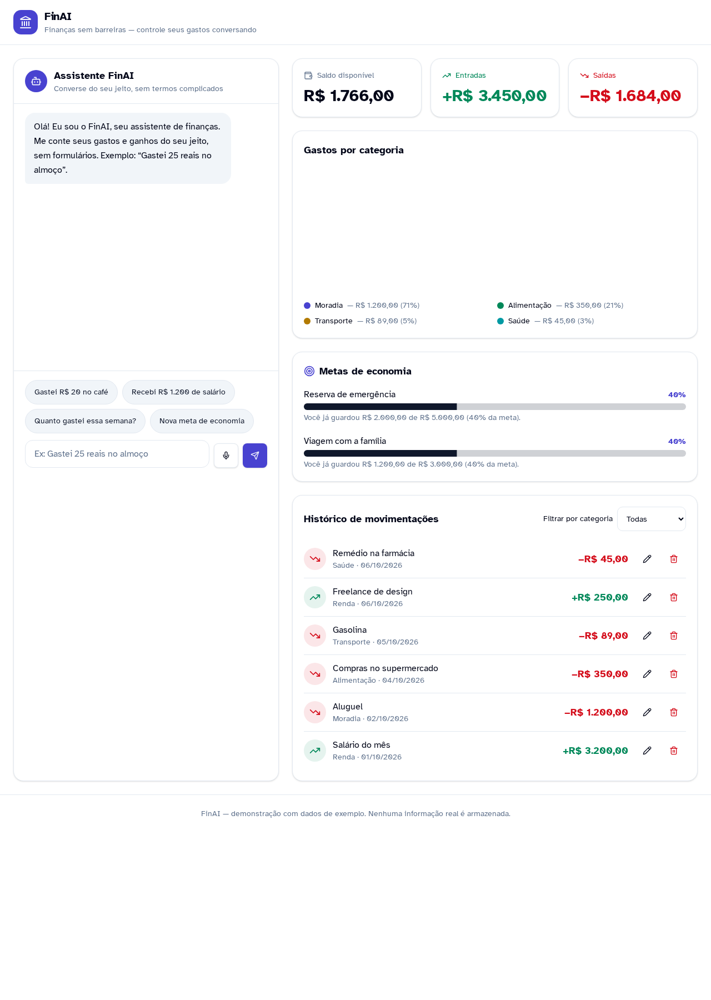
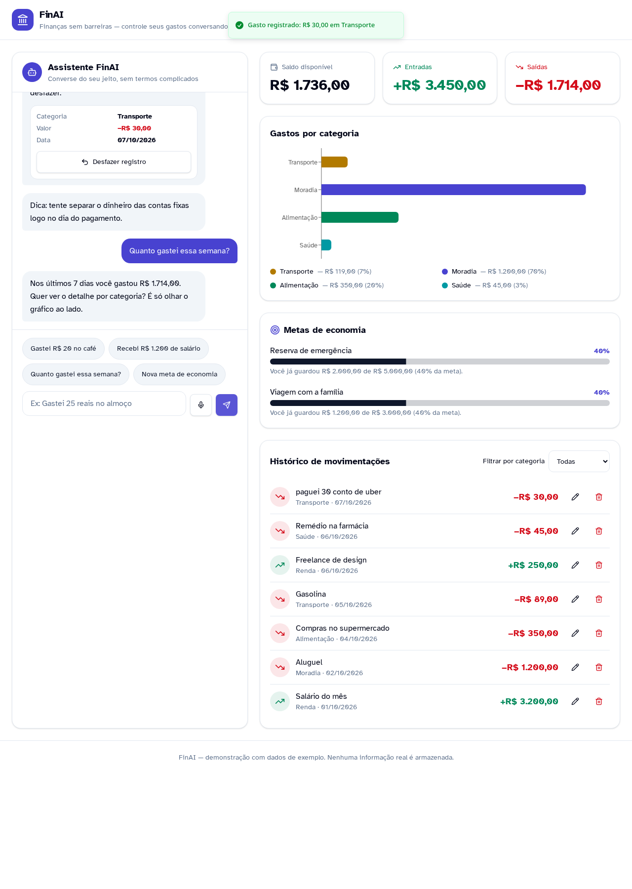
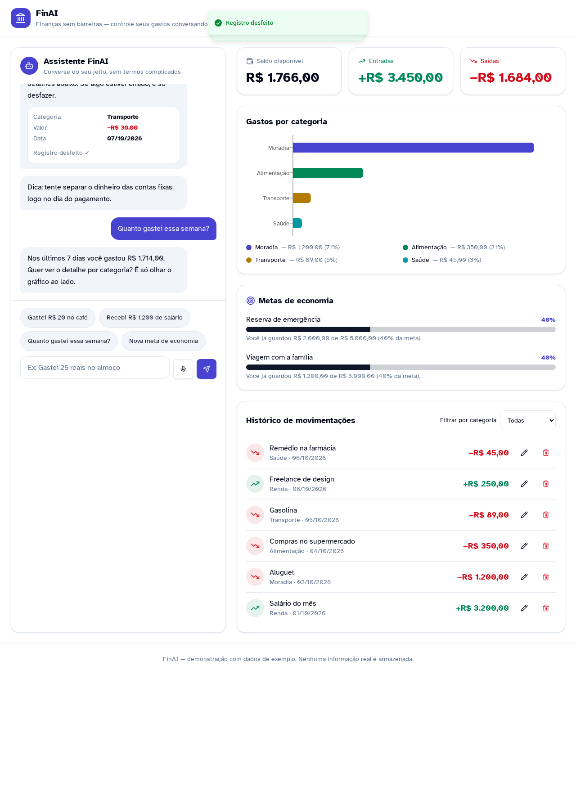

# 💸 FinAI — App de Organização de Finanças Pessoais com Vibe Coding & Design Universal

> Projeto prático desenvolvido para o desafio **"Criando um APP de Organização de Finanças Pessoais com Vibe Coding"** da plataforma **Digital Innovation One (DIO)**.  
> Repositório original de referência: [dio-lab-vibe-coding-app-financas](https://github.com/digitalinnovationone/dio-lab-vibe-coding-app-financas)

---

## 🚀 Aplicação Publicada (Live Demo)

A versão funcional e responsiva gerada no Lovable está publicada e pronta para testes:  
🔗 **[https://finai-dio.lovable.app](https://finai-dio.lovable.app)**

---

## ✨ O que é Vibe Coding?

**Vibe Coding** é uma abordagem moderna e centrada em intenção para o desenvolvimento de software impulsionada por IA generativa. Em vez de escrever linhas manuais de sintaxe, gerenciar configurações de ambiente e debugar componentes repetitivos, o desenvolvedor assume o papel de **arquiteto e diretor de produto**.

> *"Você expressa a intenção e as regras da sua ideia de forma clara, e a IA traduz o conceito em uma aplicação funcional e interativa."*

Nesse paradigma, o valor técnico migra da memorização de comandos para a **habilidade de especificar requisitos (PRD)**, desenhar fluxos lógicos, guiar ferramentas como **Lovable** ou **Copilot** e avaliar criticamente a experiência de uso.

---

## 🎯 Conceito do Projeto & O Problema

### O Problema
A maioria das pessoas abandona o controle financeiro por conta do atrito de uso:
* Formulários longos e preenchimento burocrático de cada centavo gasto.
* Falta de compreensão sobre categorias contábeis formais.
* Interfaces rígidas que causam fadiga cognitiva e desmotivação.

### A Solução: FinAI
O **FinAI** elimina essas barreiras permitindo que o usuário gerencie todo o seu dinheiro através de uma conversa fluida em linguagem natural. Ele interpreta gírias e frases cotidianas do português (ex.: *"paguei 30 conto de uber"* ou *"recebi 1200 de salário"*), alimentando automaticamente um painel visual com métricas, metas e relatórios sem que o usuário precise abrir uma única planilha.

---

## ♿ Design Universal & Acessibilidade (WCAG 2.1 AA)

A aplicação foi planejada sob as diretrizes do **Design Universal**, garantindo que qualquer pessoa consiga utilizar o produto com autonomia e sem barreiras:

* **Tipografia Acessível:** Implementação nativa da família tipográfica **Atkinson Hyperlegible**, criada pelo *Braille Institute* para maximizar a distinção entre caracteres semelhantes.
* **Informação Multimodal:** Dados financeiros nunca dependem exclusivamente de cores: entradas são identificadas com o sinal `+` e ícones ascendentes; saídas contam com o sinal `−` e ícones descendentes.
* **Tolerância a Falhas (Princípio 5 do Design Universal):** Todo lançamento pelo chat exibe imediatamente um card com o botão **"Desfazer registro"**, permitindo reversão instantânea de qualquer erro com restauração automática de saldo.
* **Operabilidade e Alvos de Toque:** Botões, campos de entrada e atalhos rápidos com dimensões mínimas de 44x44 px e foco visível para navegação por teclado.
* **Flexibilidade de Entrada:** Suporte a digitação em texto, atalhos rápidos em chips de 1 clique e botão com microfone simulado para suporte a comandos de voz].
* **Legibilidade Sem Dependência de Hover:** Gráficos com valores em reais e porcentagens fixadas em texto visível, sem exigir passagem do mouse para consulta.

---

## 📸 Demonstração do Aplicativo e Interações

### 1. Dashboard Inicial
Visão panorâmica dos cards de resumo com Saldo Disponível de R$ 1.766,00, gráfico de categorias e metas de economia:



---

### 2. Conversação em Linguagem Natural com Gírias
Ao receber o comando informal *"paguei 30 conto de uber"*, a IA categorizou automaticamente o lançamento como **Transporte**, debitou o saldo para R$ 1.736,00 e exibiu o toast de confirmação na tela:



---

### 3. Mecanismo de Tolerância ao Erro (Desfazer Ação)
Ao clicar em "Desfazer registro", o débito foi anulado, o saldo retornou a R$ 1.766,00 e o sistema confirmou a reversão via notificação visual:



---

## 📄 PRD Final (Prompt Utilizado com a IA no Lovable)

Abaixo está o Documento de Requisitos de Produto (PRD) completo utilizado para guiar a criação do app no Lovable:

```markdown
# Product Requirements Document (PRD): FinAI - Assistente Conversacional e Inclusivo de Finanças

## 1. Visão Geral & Proposta de Valor
- Nome do Produto: FinAI
- Conceito: Aplicação web de gestão financeira pessoal guiada por inteligência artificial conversacional em linguagem natural.
- Proposta Única de Valor (UVP): "Finanças sem barreiras: controle seus gastos conversando do seu jeito, sem formulários ou termos complicados."
- Público-Alvo: Amplo e inclusivo — desde iniciantes em educação financeira e idosos até usuários que buscam praticidade e pessoas que utilizam tecnologias assistivas.

## 2. Princípios de Design Universal & Acessibilidade (WCAG 2.1 Nível AA)
1. Perceptibilidade & Contraste: 
   - Taxa de contraste mínima de 4.5:1 para textos normais e 3:1 para elementos de interface e gráficos.
   - Informações nunca dependem exclusivamente de cores (despesas usam cor vermelha acompanhada de sinal de subtração − e ícone de saída).
2. Operabilidade & Alvos de Toque:
   - Todos os botões, chips e campos clicáveis devem ter área mínima de toque de 44x44 pixels.
   - Navegação por teclado com foco visível.
3. Compreensibilidade & Carga Cognitiva Baixa:
   - Textos curtos, vocabulário acessível e ausência de jargões técnicos.
   - Mensagens explicativas e toasts acessíveis.
4. Tolerância ao Erro:
   - Ação imediata de reversão ("Desfazer registro") no card de confirmação.
5. Múltiplas Modalidades de Entrada:
   - Campo de digitação de texto com botão simulado de comando de voz (microfone) e atalhos rápidos (chips de 1 clique).

## 3. Identidade Visual & Design System
- Estética: Limpa, organizada e moderna com hierarquia visual clara.
- Tipografia: Atkinson Hyperlegible.
- Cores: Fundo Slate/Zinc neutro, verde esmeralda para entradas/metas, vermelho coral para saídas e índigo para o assistente.
- Componentes: shadcn/ui + Tailwind CSS com ícones Lucide e suporte a tags semânticas ARIA.

## 4. Arquitetura de Telas (Dashboard Unificado)
- Coluna A (Chat): Entrada multimodal, chips rápidos ("Gastei R$ 20 no café", "Recebi R$ 1.200 de salário"), histórico com cards de confirmação e botão de desfazer.
- Coluna B (Painel): Cards de resumo (Saldo, Entradas, Saídas), gráfico horizontal de categorias com legendas textuais e porcentagens permanentes, metas com barra de progresso numérica e histórico de movimentações com filtros.

## 5. Simulação de Lógica do Agente (Mock Logic)
- Compreensão de gírias cotidianas ("conto", "pila", "uber", "remédio").
- Atualização em tempo real de saldo e gráficos.
- Mecanismo funcional de reversão de estado ao clicar em "Desfazer".
```

---

## 💡 Reflexão sobre o Processo de Vibe Coding

### O que funcionou muito bem?
* **Acurácia do PRD Estruturado:** Detalhar a paleta, os estados visuais e as diretrizes de acessibilidade antes da geração fez o Lovable criar a tela de primeira, eliminando refatorações visuais ou de alinhamento.
* **Processamento Semântico Fluido:** A IA entendeu expressões informais brasileiras e vinculou as deduções em dinheiro ao recálculo do dashboard de forma instantânea.
* **Velocidade de Execução:** Toda a concepção, prototipação visual e deploy público foram realizados em questão de minutos.

### Desafios e Ajustes
* **Gestão de Escopo:** Manter o foco no MVP exigiu evitar a inserção precoce de telas de login ou integrações complexas de backend, priorizando a validação da experiência do usuário sem fricção de acesso.
* **Coexistência de Componentes:** Posicionar o chat conversacional lado a lado com os gráficos analíticos sem causar poluição visual exigiu definir uma hierarquia de duas colunas bem calibrada.

### O que aprendi sobre conversar com IAs?
1. **Especificação é Código:** No ecossistema de Vibe Coding, prompts vagos geram produtos genéricos. Quanto mais rico for o contexto e os critérios de validação entregues à IA, mais próximo de nível sênior será o resultado.
2. **Acessibilidade se projeta no início:** Incorporar regras do Design Universal e WCAG já no PRD assegura que a arquitetura do código gerado já nasça semântica e inclusiva.

---

## 🛠️ Tecnologias Utilizadas

* **Plataforma de Desenvolvimento & Deploy:** [Lovable.dev](https://lovable.dev)
* **Framework:** React com TypeScript
* **Estilização & Componentes:** Tailwind CSS, shadcn/ui
* **Ícones:** Lucide React
* **Tipografia:** Atkinson Hyperlegible (Braille Institute)

---

## 👤 Autor e Créditos

Projeto concebido e desenvolvido por **Diego Floriano Costa** como entrega prática para o desafio de projeto da **Digital Innovation One (DIO)**.
